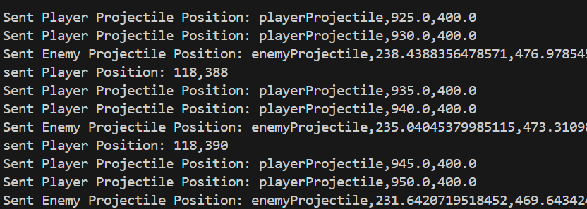

# Pirate Battleship Game (COSC 4490 - Project 3, Aswin )

## Overview

Welcome to **Pirate Battleship**, a 2D game where you control a pirate ship navigating treacherous seas filled with obstacles, enemy threats, and procedurally generated levels. The objective is to safely guide your ship while avoiding collisions with rocks and enemy attacks. Use your ship's cannon to destroy enemy boats and progress through dynamically generated levels. A collision with a rock or an enemy attack results in game over. However, you can restart and try again by pressing the "R" key.

Built in Java with Swing for graphics, this game includes custom assets for the pirate ship, rocks, enemies, projectiles, and sea background, along with sound effects and a debug mode for development insights.

## Features

- **Title Screen**: A welcome screen with a "Start Game" button to begin and an overview of controls.
- **Pause Menu**: A menu allowing players to pause, resume, reset, or quit the game.
- **Boat Navigation**: Use the arrow keys to control the pirate ship’s movement.
- **Obstacle Collision**: Game ends if the ship collides with a rock or an enemy.
- **Projectile System**:
  - Player can fire projectiles by pressing the **Spacebar**.
  - Enemy boats fire projectiles when the player is within range.
  - Particle effects simulate the destruction of enemy boats when hit by a player projectile.
- **Enemy AI**:
  - AI-controlled enemy boats patrol specific areas and engage the player when in range.
  - Enemy boats dynamically detect and shoot at the player.
- **Procedural Levels**: Each game won generates a new level layout with varying obstacle positions and enemy patrol areas. Player can press "N" key one a level is won to go to the next level.
- **Debug Mode**: A toggle-able debug mode displaying FPS, update stats, frame counters, hitboxes, and other debugging information.
- **Restart Game**: Press "R" to restart the game after it ends.
- **Dynamic Maps**: Procedurally generated maps with unique obstacles and enemy patrol areas for each playthrough.
- **Sound Effects**: Audio feedback for movement, collisions, and projectile firing.Background music that pauses when game is paused and restarts upon resetting the game.
- **Custom Assets**: Assets for the boat, sea, rocks, projectiles, and enemy boats.

## Installation

1. Clone this repository to your local machine:

    ```bash
    git clone https://github.com/ShiroW0lf/pirate-battleship-game.git
    ```

2. Navigate to the project directory:

    ```bash
    cd pirate-battleship-game
    ```

3. Ensure you have Java installed. If not, download the latest JDK from [Oracle](https://www.oracle.com/java/technologies/javase-jdk11-downloads.html).

4. Open the project in your preferred IDE (e.g., IntelliJ IDEA, Eclipse, or NetBeans).

5. Compile and run the `PirateBattleshipGame.java` file from the `src` folder to start the game.

## Controls

- **Arrow Keys**: Move the boat up, down, left, and right.
- **Spacebar**: Fire projectiles at enemies.
- **P Key**: Pause or resume the game.
- **R Key**: Restart the game after the boat collides or if paused.
- **N Key**: Takes you to next level when level is completed.
- **Q Key**: Quit the game.
- **D Key**: Toggle debug mode to display game stats, hitboxes, and counters.
- **Mouse Click**: Start the game by clicking the "Start Game" button on the title screen.

## Game Assets

- **Boat**: A pirate ship controlled by the player (`boat.png`).
- **Sea**: Background of the game (`sea.gif`).
- **Rocks**: Various rock obstacles of different sizes (`rock1.png`, `rock2.png`, `rock3.png`).
- **Enemy Boat**: AI-controlled enemy boats that patrol and engage (`enemyBoat1.png`).
- **Projectiles**: Cannonballs fired by the player and enemy boats (`Fireball.png`).
- **BG MUSIC**: Background music (`bgMusic.wav`).
-- **Sound effects**: sound effects (`boatcrash.wav`).

## How to Play

1. Launch the game by running `PirateBattleshipGame.java`.
2. On the title screen, click "Start Game" to begin.
3. Use the arrow keys to navigate the pirate ship across the sea, avoiding rocks and enemy patrols.
4. Press **Spacebar** to fire at enemy boats.
5. Press "P" to pause or resume the game.
6. Press "R" to restart the game if you lose.
7. Press "N" to go to next level once you complete a level.
8. Toggle the debug mode with "D" to see stats like FPS, counters, and hitboxes for development insights.

## Customization

- **Obstacle Placement**: Adjust the positions and sizes of the rocks by modifying the `generateRocks()` method in `GameCanvas.java`.
- **Enemy Behavior**: Modify patrol areas and detection range in `EnemyBoat.java`.
- **Assets**: Replace the game assets (ship, rocks, sea, projectiles, enemy boat) by adding new images to the `src/assets` folder and updating their file paths in the code.
- **Sound Effects**: Customize sounds by adding audio files to the assets folder and adjusting their file paths in the game code.

## Project Updates

### **Projectile System**:
- Player fires projectiles using the Spacebar.
- Enemy AI detects the player and fires projectiles.
- Particle effects simulate destruction when an enemy boat is hit.

### **Enemy AI**:
- Enemy boats dynamically patrol specified areas.
- AI detects the player in range and engages with projectiles.

### **Procedural Levels**:
- Each game reset generates a new level layout with dynamic obstacles and enemy patrol areas.

### UDP Multiplayer Mode

#### Overview
The game includes a **UDP-based multiplayer mode**, allowing players to interact and compete in real-time. A client-server architecture is used, where the server manages game state and synchronizes player actions.

## How It Works
- **Server**:
  - Listens on port **9876** for incoming messages.
  - Receives player actions (e.g., movements, firing projectiles) and distinguishes between player positions, player projectiles, and enemy projectiles.
  - Broadcasts updated game state to all connected clients.
  
- **Client**:
  - Sends player actions to the server, including player boat position and projectile positions (for both player and enemy projectiles).
  - Each message includes a type identifier (e.g., `PLAYER_POSITION`, `PLAYER_PROJECTILE`, `ENEMY_PROJECTILE`) to distinguish between the different types of data.
  - Receives game state updates from the server and reflects changes in the local game environment.

## Running the Multiplayer Mode
1. **Start the Server**:
   - Run the `GameServer` class to initialize the server:
     ```bash
     java GameServer
     ```
   - The server will log all incoming messages and broadcast updates.
   - The server can distinguish between:
     - `PLAYER_POSITION,x,y` — Player's boat position.
     - `PLAYER_PROJECTILE,x,y` — Player's projectile position.
     - `ENEMY_PROJECTILE,x,y` — Enemy's projectile position.

2. **Start the Client**:
   - Run the `PirateBattleshipGame` class to start the game as a client.
   - The game client will:
     - Send player boat position to the server with the format `PLAYER_POSITION,x,y`.
     - Send player projectile positions to the server with the format `PLAYER_PROJECTILE,x,y`.
     - Send enemy projectile positions to the server with the format `ENEMY_PROJECTILE,x,y`.


#### Benefits
- Enables real-time interaction between multiple players.
- Synchronizes game state across clients for consistent gameplay.
- Introduces competitive and cooperative multiplayer possibilities.


### **Debugging Enhancements**:
- Enhanced debug mode with hitboxes for projectiles and improved performance stats.

## Future Enhancements

- **Advanced AI**: Smarter enemy behavior and dynamic difficulty adjustment.
- **Level Progression**: Adding additional levels with increasing complexity.
- **Boss Battles**: Introduce larger enemy ships or stationary towers as end-level challenges.

## Credits

- **Development**: [Aswin Lohani]
